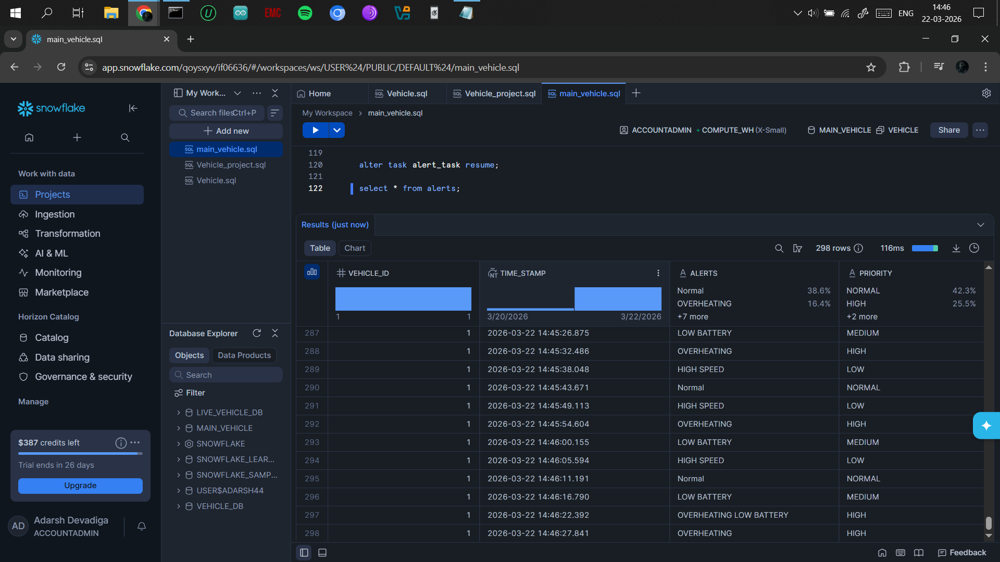
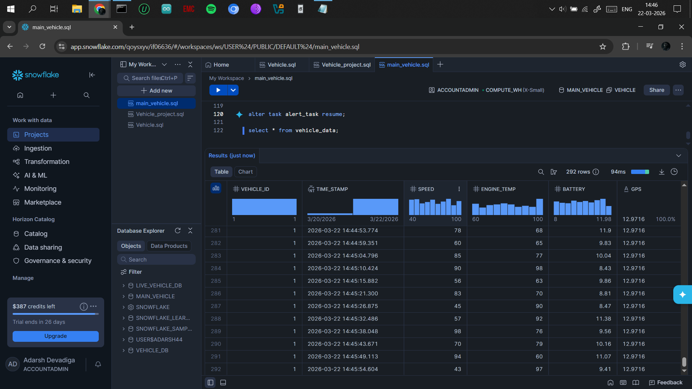
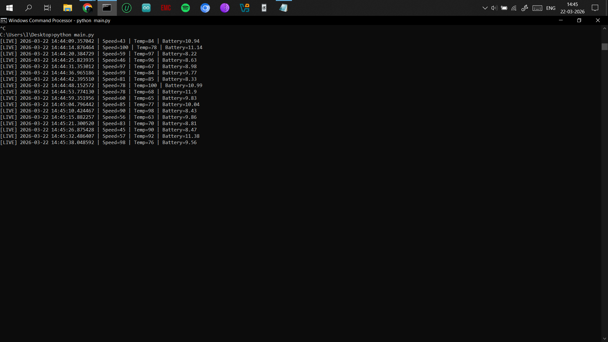

Vehicle Telemetry Monitoring System

##  Overview
This project simulates a real-time vehicle monitoring system using Snowflake and Python.  
It continuously generates vehicle data and automatically detects abnormal conditions like overheating, low battery, and high speed.

---

## Features
- Real-time data ingestion using Python
- Structured data storage in Snowflake
- SQL-based alert detection system
- Automated alert generation using Snowflake TASK
- Priority classification (HIGH, MEDIUM, LOW)

---

## Alert Conditions
- Engine Temperature > 90 → OVERHEATING
- Battery < 9V → LOW BATTERY
- Speed > 85 → HIGH SPEED

---

## Architecture
Python → Snowflake (vehicle_data) → TASK → alerts table

---

##  Tech Stack
- Snowflake
- SQL
- Python

---

##  Output

### 🔹 Alerts Table

### 🔹 Vehicle Data

### 🔹 Python Live Data
